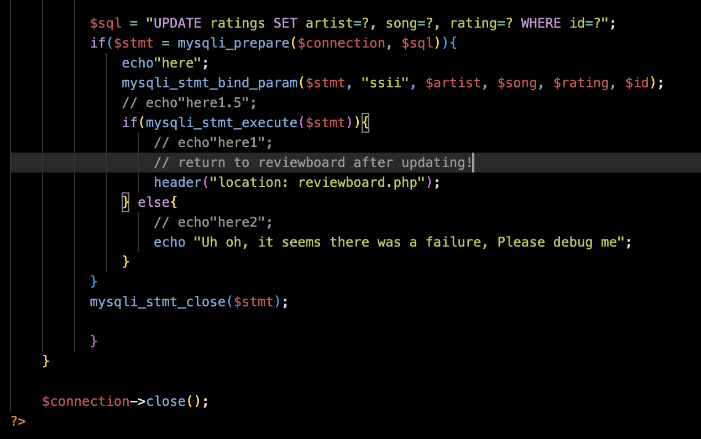

# comp333bartekgavin
Homework 1 repository :). effective-pancake

Teammates: Ian, Bartek, Gavin

Purpose of the code: Display a mock landing page for a music discussion site :). 

Repo contents: Some images (album covers), index.html (our website), style-sheet.css, sign-in.html, what da dog doing.gif which is an image for another site, dog-chilling.html, also in the repo, which we post in as an iframe, and a license file. And of course the readme, but you already know that :p.

How to run the file: 
https://ghorningkane.github.io/comp333ianbartekgavin/
is the link to our website from the repo, otherwise download the repo, and open index.html in a browser. 

Work split was even :). We did have a lot of issues with github version control though haha, we got it worked out in the end.

# HW2 Readme Section
To start navigating one must go to 'index.php'

# Setting Up Development Environment/Production Environment: 

# PHPMyAdmin Initial Image:

# Table Structure: 'users' Table:

# Table Structure: 'ratings' Table:

# User Functionality/Features:

# Website Link:
 xampp.great-site.net

# Users Can Only Rate Once:
The same user does not have the ability to enter the same entry twice without seeing this error:

# Users Must Have a Login, No Duplicate Users are Allowed, and Users Stay Logged in:
In the instance someone attempts to sign up with a duplicate user they are met with this error:

# The Registration Asks For Users to Enter Their Passwords Twice to Ensure Correctness:

# If a User Requests the Registration Page, They Are Redirected to the List of Rated Songs:
One cannot request the login/user page from the reviewboard due to the reviewboard having no links to it. The homepage has a link to sign up meaning that our problem is solved!

# At the top of Each Page the Current User is Displayed and Concurrently, All Ratings Are Visable for All, but Only Interractable for Those Who Created the Rating:

# Updating/Deleting/Canceling Brings One Back to the List of Ratings:
This is hard to prove with a simple screenshot, but this is most certainly implemented as shown through this code and its comments...

# Via the Frontend Requisites Are Present:
Users cannot leave fields blank, and users cannot make a password smaller than 10 characters long:

# Users Cannot Rate With More Than One Integer:
Attempt at breaking rule:

Returned error:

Alternative Attempt:

Error:

# SQL Querries Are Parameterized to Avoid Injection Attacks:

# Passwords are hashed:

# Our work was split evenly once again!

